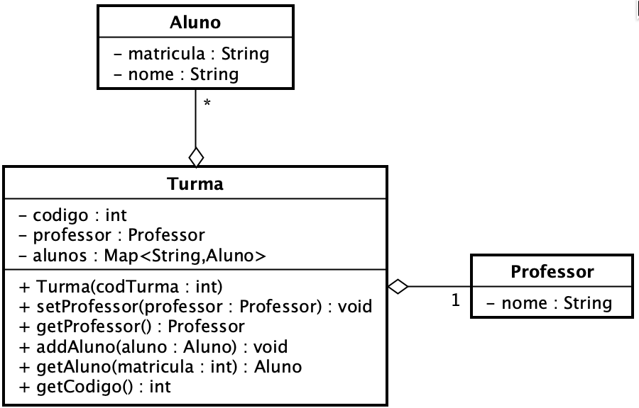

**Universidade Federal da Paraíba - UFPB** \
**Centro de Ciências Exatas e Educação - CCAE** \
**Departamento de Ciências Exatas - DCX**

**Professor:** [Rodrigo Rebouças de Almeida](http://rodrigor.dcx.ufpb.br)

# Atividade: Disciplina - Turma

Implemente as classes especificadas no diagrama abaixo

