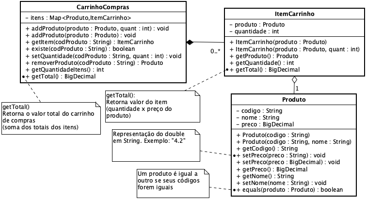

**Universidade Federal da Paraíba - UFPB** \
**Centro de Ciências Exatas e Educação - CCAE** \
**Departamento de Ciências Exatas - DCX**

**Professor:** [Rodrigo Rebouças de Almeida](http://rodrigor.dcx.ufpb.br)

# Atividade 

Altere as classes `CarrinhoCompras`, `ItemCarrinho` e `Produto` de modo que os testes passem.

Estude os testes. Veja a lógica por trás de cada método testado. Antes de corrigir o código existente, analise bem o que o teste está testando.

