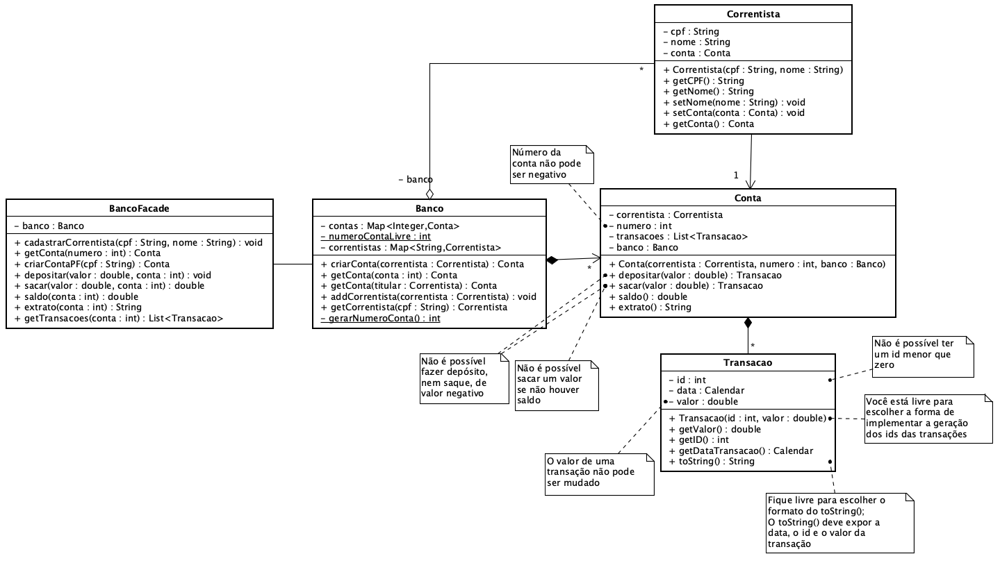

**Universidade Federal da Paraíba - UFPB** \
**Centro de Ciências Exatas e Educação - CCAE** \
**Departamento de Ciências Exatas - DCX**

**Professor:** [Rodrigo Rebouças de Almeida](http://rodrigor.dcx.ufpb.br)

# Atividade

* Padrões: Façade
* Conceitos OO: Composição, agregação, encapsulamento

* Implemente as classes especificadas no diagrama a seguir.
* Considere as regras definidas nas anotações do diagrama e as regras implementadas nos testes automáticos.

