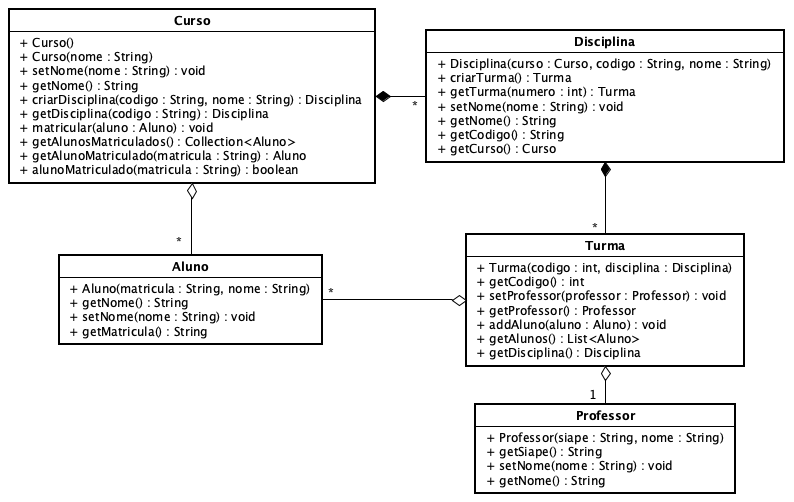

**Universidade Federal da Paraíba - UFPB** \
**Centro de Ciências Exatas e Educação - CCAE** \
**Departamento de Ciências Exatas - DCX**

**Professor:** [Rodrigo Rebouças de Almeida](http://rodrigor.dcx.ufpb.br)

# Atividade

1. Implemente uma fachada para o sistema de controle acadêmico descrito no 
diagrama abaixo. (Pense nos métodos que devem ser expostos na fachada).

2. Implemente as classes especificadas no diagrama abaixo, de modo que os 
testes passem.

Observe que o diagrama não especifica os atributos das classes. Você tem liberdade para implementar os atributos que julgar necessários.

