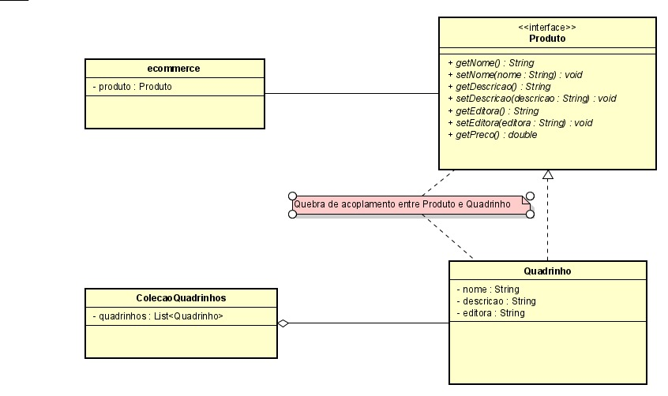
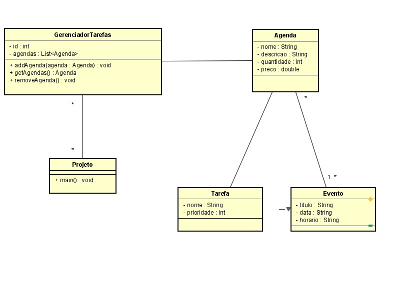

**Universidade Federal da Paraíba - UFPB** \
**Centro de Ciências Exatas e Educação - CCAE** \
**Departamento de Ciências Exatas - DCX**

**Professor:** [Rodrigo Rebouças de Almeida](http://rodrigor.dcx.ufpb.br)

# Atividade 1

Projete um sistema gerenciador de coleção de quadrinhos. Neste sistema, uma coleção tem um nome e agrupa vários quadrinhos. Um quadrinho possui nome, descrição e editora. Considere também um sistema de ecommerce que vende produtos. Um produto possui nome, descrição, quantidade e preço. Deve ser possível vender quadrinhos no sistema de ecommerce.

Envie uma imagem contendo o diagrama UML.

## Atividade 2

Projete um sistema de gerenciamento de tarefas que é integrado a um sistema de agenda. O gerenciador de tarefas gerencia vários projetos e cada projeto pode ter várias tarefas. Cada tarefa tem nome e prioridade, representada por um inteiro. A tarefa pode ser agendada no sistema de agenda. Uma agenda possui vários eventos. Cada evento possui um título, uma data e um horário. 

Envie uma imagem contendo o diagrama UML.

Opcional: Implemente as classes e interfaces que você projetou.

